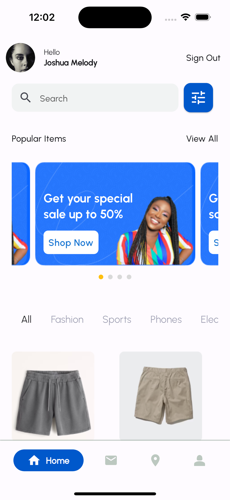
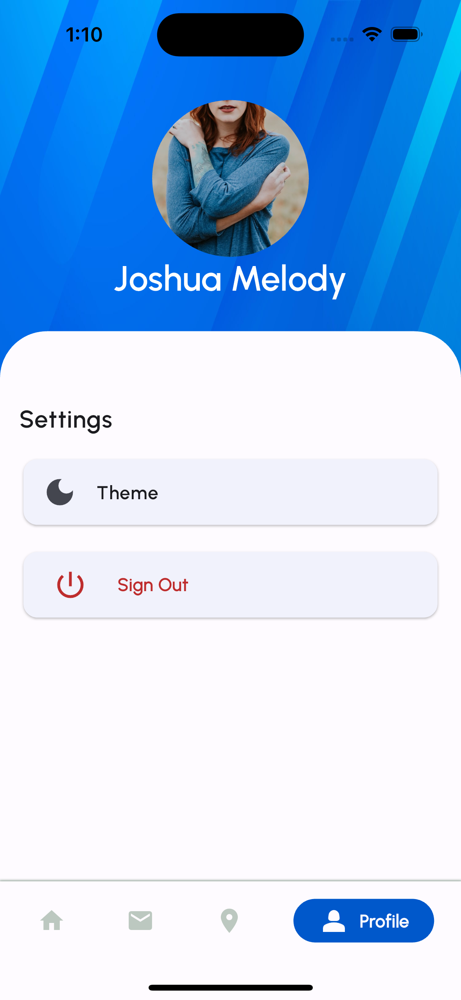

   
   
  <h1>LearnGual Assessment</h1>
  <strong>A Mobile app that was built as part of an assessment by LearnGual team. This test was to indicate the use of WebSockets, and REST API in authentication.</strong>
   

Built by <a href="https://twitter.com/CapturedWarrior">Captured-Heart</a>
 

<i><h3 style="color: green">You can download the apk directly from my firebase distribution console <a href="https://appdistribution.firebase.google.com/testerapps/1:1045501620992:android:7d15006ffe90bd5e3b39e5/releases/53iq4chg2o4do?utm_source=firebase-console">LearnGual Assessment</a></h3></i>

# Features

- Create an account ($baseUrl/user/register)
- Login ($baseUrl/user/login)
- WebSockets integrated for chat(Every other information concerning this can be found by clicking "Check info" button at the AppBar of the Chat screens)
- Dark and light themes for a personalized look
- Multiple langauges (i.e: Localization enabled), currently English and Spanish

## UI Shots

  <table>
    <tr>
      <td style="text-align: center">
        
      </td>
      <td style="text-align: center">
        
      </td>
      <td style="text-align: center">
        
      </td>
      <td style="text-align: center">
        
      </td>
      <td style="text-align: center">
        
      </td>
    </tr>
    <tr>
      <td style="text-align: center">
        
      </td>
      <td style="text-align: center">
        
      </td>
      <td style="text-align: center">
        
      </td>
      <td style="text-align: center">
        
      </td>
      <td style="text-align: center">
        
      </td>
    </tr> 
  </table>

## Tools

- [web_socket_channel: StreamChannel wrappers for WebSockets. Provides a cross-platform WebSocketChannel API, a cross-platform implementation of that API that communicates over an underlying StreamChannel.](https://pub.dev/packages/web_socket_channel)
- [persistent_bottom_nav_bar: A persistent/static bottom navigation bar for Flutter.](https://pub.dev/packages/persistent_bottom_nav_bar)
- [shared_preferences: Use this tool for persistent storage for simple data](https://pub.dev/packages/shared_preferences)
- [HTTP: A composable, Future-based library for making HTTP requests. This package contains a set of high-level functions and classes that make it easy to consume HTTP resources. It's multi-platform, and supports mobile, desktop, and the browser.](https://pub.dev/packages/http)
- [flutter_riverpod: A very great tool for managing states across the application by Remi Rousselette ](https://pub.dev/packages/flutter_riverpod)
- [Easy_Localization: This package simplify the internationalizing process](https://pub.dev/packages/easy_localization)
- [faker: A library for Dart that generates fake data such as images, names etc](https://pub.dev/packages/faker)

For a full description of OSS used, see pubspec.yaml
